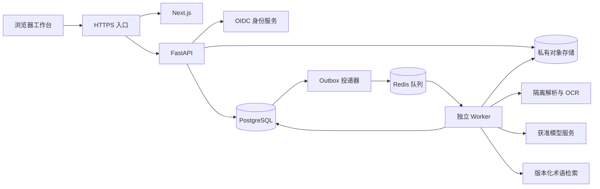

# 临床数据结构化平台开发计划

版本：v1.0 · 编制日期：2026-09-16  
依据：[PRD.md](./PRD.md)、[index.html](./index.html)、[设计约定](./.impeccable.md)  
状态：S0 工程基线已实现并通过本地验证（2026-09-16）；FND-05 的机构授权决策待提供。详见 [S0 验收记录](docs/testing/s0-report.md)。S1 文档与持久化已完成本地合成开发与验证（2026-09-17），见 [S1 验收记录](docs/testing/s1-report.md)；S2 抽取与证据工程实现已完成本地合成验证（2026-09-17），见 [S2 验收记录](docs/testing/s2-report.md)。S3 工作台、审核和导出已完成本地合成开发与验证（2026-09-18），见 [S3 验收记录](docs/testing/s3-report.md)。S4 管理与质量闭环已完成本地工程实现和合成验证（2026-09-18），见 [S4 验收记录](docs/testing/s4-report.md)；S5 尚未实施；S2 的获准真实模型/中文 OCR/临床样本验收仍待 FND-05 条件。

## 1. 交付目标与边界

交付面向内分泌科／糖尿病研究的文档结构化平台，完成「导入门诊记录和检验报告 → 解析／OCR → 事实抽取与证据定位 → 术语映射与规则校验 → 人工审核 → 可追溯数据导出」闭环。保留现有原型的六个业务页面、三栏工作台和视觉风格，以真实服务替换内存数据与演示行为。

### 1.1 范围分层

| 阶段 | 必须交付 | 不纳入该阶段 |
| --- | --- | --- |
| P0／M2 工程 MVP | TXT、电子 PDF、清晰扫描 PDF／PNG／JPEG；门诊和检验模板；身份与项目隔离；异步处理；事实／证据；人工审核；JSON／CSV；基础审计与实测基线 | 自动通过审核、临床建议、复杂手写、原始 CT／MRI 分析 |
| P0／M3 质量闭环 | 模板与指南版本；小范围正式术语词库；金标准、复核与裁决；独立评测；纠错样本二次复核 | 未验证的模型微调、跨就诊病程推断、通用标注平台 |
| M4 机构试点 | 获准环境、权限与留存配置、备份恢复、监控、风险与质量门槛、培训及回滚 | 承诺基于演示数值的模型效果或生产吞吐 |
| P1 | 住院长病历、多科室、复杂版面、企业系统批量对接、多级审核、FHIR 交换、多词库与 MedDRA | 需单独评估范围、授权、成本及排期 |

当前 M1 已有原型资产，须补做原型回归记录后作为界面基线；不将现有演示等同于生产功能完成。

### 1.2 全过程必须保持的规则

1. 每条事实有可定位证据；无证据的模型输出不得作为有效事实静默入库。
2. 「未提及」「明确未知」「无法辨认」「不适用」与否定语义独立表达，不用空字符串混为一谈；PRD 示例中的 `explicitly_unknown` 必须保留。
3. 剂量不按常规用量补全，编码只能来自指定版本词库；允许有理由地保留未知／待映射。
4. 阻断项全部处置、全部事实完成复核且审核人员明确确认后，才允许完成审核；服务端执行判定。
5. 已审核内容修改、新文书加入审核范围或有效抽取版本切换后，当前审核失效；历史审核快照保持不变。
6. 默认仅导出已审核快照。导出草稿必须有权限并显式选择，逐条标记状态。
7. 不凭姓名合并患者；项目、患者、就诊、文书和证据归属须可验证。
8. 测试集按患者隔离并冻结；生产纠错不得未经二次复核进入训练／评测集。

## 2. 从原型迁移到产品

| 原型页面／行为 | 正式路由（项目范围内） | 实施内容与差距 |
| --- | --- | --- |
| `renderDocuments()`，本地预览／搜索 | `/projects/[projectId]/documents` | 服务端上传、校验、患者／就诊关联、进度、失败详情、取消与重试、分页筛选；保留上传前预览 |
| `renderReview()`，固定八个字段、两份文书 | `/projects/[projectId]/reviews/[reviewSetId]` | 动态 Schema、可重复实体、真实 PDF／图片／文字预览、多页多证据、版本保存、冲突处理、审核队列 |
| `renderTemplates()`，只读 Schema／指南 | `/projects/[projectId]/templates` | 草稿编辑、类型／必填／枚举／数组、指南维护、发布检查、不可变版本；P0 编辑方式为结构化表单＋JSON 编辑，暂不做拖拽设计器 |
| `renderTerminology()`，固定待映射表 | `/projects/[projectId]/terminology` | 固定版本词库检索、候选依据、人工确认／拒绝／保留待映射、映射记录 |
| `renderDatasets()`，单病例统计 | `/projects/[projectId]/datasets` | 患者／就诊／文书／审核状态筛选、真实计数、导出任务、文件有效期与下载审计 |
| `renderQuality()`，模拟 TP／FP／FN | `/projects/[projectId]/quality` | 数据集版本、真实评测运行、分层指标、版本对比、错误样本、耗时与成本；无结果显示空状态 |
| 抽屉、Toast、导航、病例条 | 共享组件 | 抽屉焦点锁定与恢复、键盘关闭、消息提示、权限态、加载／空／失败态、项目切换 |
| `approve()`／`invalidate()`／`exportData()` | 审核与导出服务 | 从浏览器内存迁移为事务、不可变快照和服务端门禁；不沿用单一全局 `approved` 布尔值 |

### 2.1 设计还原要求

- 保留「文档转表格」SVG、完整中文产品名、深青绿主色 `#176653`、灰绿工作区 `#f5f7f4`、暖白文档 `#fffefa`、琥珀复核提示及现有导航顺序。
- 以 CSS 变量组织设计 token，使用本地系统字体；文书正文与应用界面维持宋体／无衬线的区分。
- 原型断点作为迁移起点：大于 1190px 三栏，761～1190px 双栏＋下方质量区，不大于 760px 纵向复核；同时验证 390、768、1024、1440、1920px。
- 抽取字段、病程时间线、JSON 三个视图保留。时间线由有依据的事件时间生成，不根据相对病程虚构日期。
- 缩放、分页、滚动后证据仍准确；同一证据关联多个字段时提供选择列表。字段操作不能只依赖双击，保留明显编辑入口。
- 保留密集但清楚的表格布局；生产页面的文字对比度、最小可读字号和触控区域需实测调整，不机械复制演示中的小字号。
- 错误、选中和审核状态同时用文字／图标表达；检查 Tab 顺序、可见焦点、读屏标签、200% 缩放及减少动态效果偏好，目标为 PRD 中的 WCAG 2.2 AA。
- `index.html` 保留为设计和回归参考；演示数据只在独立开发／演示模式加载，正式页面不残留模拟指标或演示账号。

## 3. 技术方案与系统边界

以下为总体实施选型。S0 已锁定前后端及基础设施版本，生成 pnpm/uv 锁文件并通过本地构建和兼容性验证；OCR、模型及机构部署供应方仍需获准样本与环境验证。版本见依赖清单及 ADR-0001。

| 层次 | 拟定方案 | 职责与选择理由 |
| --- | --- | --- |
| 前端 | Next.js App Router＋React＋TypeScript；pnpm | 页面路由、工作台与预览；业务权限和数据库访问统一在 FastAPI，避免两套业务后端 |
| 前端状态／表单 | TanStack Query；React Hook Form＋Zod；CSS Modules＋CSS 变量 | 服务端数据缓存和更新；本地仅保存选中、缩放、抽屉等界面状态；类型化表单 |
| 文档预览 | PDF.js；图片坐标覆盖层；纯文本渲染 | 真实页码、缩放、坐标映射和文本定位；不执行文档中的主动内容 |
| API | Python FastAPI＋Pydantic；uv | 身份、业务用例、输入输出校验、OpenAPI 契约 |
| 持久化 | PostgreSQL＋SQLAlchemy＋Alembic | 关系实体、事务、版本、JSONB 扩展；字段类型、外键、归属不能仅依赖 JSON |
| 异步处理 | Celery＋Redis；同仓库独立 Worker 进程 | API 快速返回任务；解析、抽取、导出分队列；PostgreSQL 保存权威任务状态 |
| 文件 | S3 兼容私有对象存储；开发环境采用兼容实现 | 原件、解析产物、模型原始输出、导出产物分前缀／生命周期管理 |
| 解析／OCR | 文字层解析器＋可替换 OCR 适配器 | 优先文字层；PaddleOCR PP-StructureV3 作为验证候选，按质量、许可、算力及成本确定 |
| 模型／术语 | 模型网关接口＋指定版本词库检索 | 隔离提供商差异；受约束抽取与编码检索分开；P0 先用数据库检索，不引入独立向量平台 |
| 身份 | 机构 OIDC；开发环境使用可替换测试身份源 | 验证令牌 issuer／audience／有效期；角色绑定到租户及项目，不自建完整账号密码系统 |
| 验证／运维 | pytest、Vitest／Testing Library、Playwright；结构化日志和 OpenTelemetry | 单元、契约、集成、浏览器与性能检查；串联 request／job／run，观测数据去敏 |

### 3.1 部署拓扑



P0 采用模块化单体 API＋独立 Worker，不提前拆分微服务。Next.js 与 API 通过同源入口暴露，避免不必要的跨域配置；基础设施不直接对公网暴露。Worker 可按 CPU／GPU 和模型调用配额分别扩容。

### 3.2 模块边界与开发约定

- 后端业务模块采用 router／schema／service／repository 分层，router 不直接拼装数据库事务；审核、导出和权限规则在服务层复用。
- Worker 调用同一业务服务和适配器，不复制审核或状态更新逻辑；长任务不得在 API 请求进程内运行。
- 后端 Pydantic 输出 OpenAPI；前端客户端与 DTO 从契约生成。`packages/contracts/` 保存发布的契约快照及兼容性检查材料，不维护第二套手写业务类型。
- 抽取 Schema、提示词、规则、术语、模型、解析器分别版本化；一次运行固定所有版本与配置摘要，重放能够定位原始输入。
- 开发 mock 通过适配器显式启用，仅使用合成数据；生产启动时禁止 demo 身份或 mock 抽取器。

## 4. 目录布局与职责

本次创建以下目录及说明文件，空叶子目录以 `.gitkeep` 保留。下列树中的 `{...}` 表示同级目录集合，不是实际目录名。

```text
bljgh/
├── PRD.md / index.html / .impeccable.md / README.md
├── DEVELOPMENT_PLAN.md
├── frontend/
│   ├── public/
│   ├── src/
│   │   ├── app/                       # Next.js 路由，初始化时创建具体页面
│   │   ├── features/                  # 按六个业务页面及身份／项目组织
│   │   │   └── {documents,review,templates,terminology,datasets,quality,identity,projects}/
│   │   ├── components/{ui,layout,document-viewer}/
│   │   ├── lib/{api,auth}/
│   │   ├── styles/
│   │   └── mocks/
│   └── tests/{unit,integration}/
├── backend/
│   ├── app/
│   │   ├── api/                       # 路由组装、统一响应和异常处理
│   │   ├── core/                      # 配置、鉴权、权限、日志
│   │   ├── db/                        # 连接、基础模型、事务工具
│   │   ├── modules/
│   │   │   └── {identity,projects,patients,encounters,documents,jobs,extractions,facts,reviews,templates,terminology,datasets,exports,quality,audit}/
│   │   ├── integrations/{storage,parsers,ocr,llm,terminology}/
│   │   └── workers/{tasks,pipelines}/
│   ├── migrations/versions/
│   └── tests/{unit,integration,contract}/
├── packages/contracts/{openapi,json-schema,examples}/
├── ai/{prompts,schemas,rules}/          # 可审阅的抽取资产，不含密钥或病例原件
├── evaluation/
│   ├── {runners,metrics}/
│   ├── datasets/{manifests,synthetic}/  # 版本清单及可提交的合成样本
│   └── reports/                       # 本地输出，不提交真实病例或指标明细
├── infra/{docker,compose,deploy,observability}/
├── scripts/{dev,db,ci}/
├── tests/{e2e,security,performance,fixtures/synthetic}/
└── docs/{architecture,api,data,testing,operations,decisions}/
```

S0 已初始化可运行前后端、迁移、Compose、契约与检查脚本；上图是目录职责基线，具体生成文件见各目录 README。未来业务设计接口与运行时分离，尚未实现的接口不挂载到正式 API。真实原件、OCR 产物及受控身份映射存储在获准环境，不能放入仓库。

## 5. 数据模型与不可变版本

### 5.1 实体设计

| 实体 | 必需信息与约束 |
| --- | --- |
| Tenant／Project／Membership | 租户、项目、成员、角色与策略；所有业务查询显式限制 tenant_id／project_id |
| Patient／PatientIdentity | 项目内患者键；受控来源系统＋来源标识唯一；身份映射独立访问控制；同名不自动合并 |
| Encounter | 患者键、就诊类型、就诊时间、科室、可信来源键；文书关联时验证同项目归属 |
| Document／DocumentVersion | 逻辑文书与不可变文件版本；原始名、真实 MIME、大小、SHA-256、来源、上传人、授权记录引用、对象键；文件重复仅在授权范围内提示 |
| ParseArtifact | 文书版本、解析器／OCR 版本、页尺寸、旋转、文本块／表格、阅读顺序、对象键、质量信号 |
| Job／JobAttempt／OutboxEvent | 任务类型、阶段、进度、尝试次数、幂等键、心跳、取消标志、错误码、时间、产物引用、待投递事件 |
| Template／TemplateVersion／GuideVersion | 草稿、已发布版本、Schema、语义说明、正反例、证据要求、指南和规则版本；发布后不可原位覆盖 |
| ExtractionRun | 文书／解析版本、Schema、模型／提示词／规则／词库版本、参数、输入摘要、状态、耗时、token 和费用；重抽取新建运行 |
| ClinicalFact／FactRevision | 稳定事实键和不可变修订；类别、实体组、字段路径、原始／标准值、单位、assertion、experiencer、时间、缺失原因、版本号、修改理由 |
| FactRelation | 药物－剂量、检验－结果－单位等有类型的关联；指向明确的事实／修订，不通过界面数组下标关联 |
| Evidence／FactEvidence | 一条事实可关联多处证据；文书和解析版本、页码、span、bbox、quote、block_id；通过关联表表达多对多 |
| Coding／TerminologyVersion | 原文、候选列表、体系、版本、编码、显示名、检索／消歧依据、确认者；编码外键必须属于指定词库版本 |
| ValidationIssue／IssueDisposition | 规则、严重度、受影响事实修订、open／resolved／accepted_unknown、理由、处理者；不把「已处理」当作值已补齐 |
| ReviewSet／ReviewSnapshot／ReviewEvent | 以同次就诊为审核范围；显式文书／运行／事实修订清单、范围版本、逐项复核、最终确认、审核快照、前后差异和理由 |
| DatasetDefinition／ExportJob／ExportManifest | 查询条件、用途、授权范围、快照成员、状态、文件哈希、过期时间、下载记录；导出不是对实时事实的无版本查询 |
| Annotation／Adjudication／GoldDatasetVersion／EvaluationRun | 标注人、复核与裁决、患者分组、冻结清单、指南版本、预测版本、指标和错误分层；候选纠错有独立入库状态 |
| AuditEvent | actor、scope、action、目标及版本、request_id、时间；追加写；业务差异详细内容按敏感数据保护，不进入通用日志 |

### 5.2 语义和存储约定

- UUID 作为内部键；外部来源键独立保存。操作时间存 UTC 并按用户时区显示；临床日期只有年月日时保留日期精度，不能强制转换成午夜时间戳。
- `assertion` 至少表达肯定／否定／疑似；`missing_reason` 至少表达 missing（应有而缺失）、not_mentioned、explicitly_unknown、not_applicable、unreadable。明确否认通过 assertion 表达，不作为 null 的同义词。
- 数值使用精确数值类型并保留原始字符串、比较符和原始单位，支持「<」「>」等检验结果；保留标准化依据，不以浮点转换改变原始含义。
- 事件时间与文书时间分开，记录 precision、原文相对时间、锚点与推导依据；「5年」不自动写为精确起病日期。
- 证据 span 采用规范化文本的 Unicode code point 半开区间 `[start,end)`；保存文本版本与原文映射。Python 与 JavaScript 做一致性契约测试，避免 UTF-16 偏移差异。
- 页码从 1 开始；bbox 使用指定页旋转归一化后的左上原点 `[0,1]` 坐标，保存原始尺寸／旋转和转换矩阵，多行使用多个框。缩放只影响显示，不重写证据坐标。
- 文书／解析／抽取版本不可变；人工纠错追加 FactRevision，不覆盖模型原始输出。事实删除采用有理由的排除修订，并保留历史。
- 新抽取结果作为候选，不能自动替换人工修订；显式选择有效运行，重新生成受影响问题并使当前审核失效。
- 高频索引以租户／项目＋状态／时间、患者来源键、就诊键、文书哈希、运行键和事实修订键为主；按真实查询计划增加索引。
- 外键和唯一约束覆盖同租户／项目归属；应用鉴权之外实施 PostgreSQL 行级隔离并测试连接池上下文清理，Worker 不能拥有随意跨租户查询能力。

## 6. 状态机、事务与并发

### 6.1 处理与审核分开建模

`Document.processing_status` 表达处理进度，`ReviewSet.status` 表达审核结论；页面将二者组合呈现 PRD 的任务链。已审核文书发起新运行时，旧审核快照仍可追溯，新结果未通过审核。

| 对象 | 转移 | 触发／限制 |
| --- | --- | --- |
| 文书任务 | imported → queued → parsing → extracting → validating → ready_for_review | validating 为术语／规则子阶段；页面可归入质量检查；上传成功不等于抽取完成 |
| 文书任务 | parsing → parse_failed；extracting／validating → extraction_failed | 对外错误含失败阶段与可重试性；保留失败产物与诊断摘要 |
| 文书任务 | 活跃状态 → cancelled | 请求取消后到阶段边界协作停止；未完成调用迟到返回时不得写成成功 |
| 文书任务 | 可重试失败／cancelled → queued | 新 attempt，明确重跑范围；重抽取／换版本则创建新 run，旧运行不覆盖 |
| 审核集合 | pending_review → approved | 当前范围内均有有效结果、无未处置阻断项、全部事实修订已核对、有最终确认 |
| 审核集合 | pending_review → awaiting_material → pending_review | 退回必须说明缺失材料；补充材料解析完成后刷新范围与问题 |
| 审核集合 | approved → pending_review | 编辑事实／证据／映射／关联，改变范围或有效版本时，在同一事务中失效 |

### 6.2 关键一致性机制

- **编辑**：`PATCH /facts/{id}` 携带期望修订号及理由；事务中检查版本、创建修订、重跑受影响规则、失效逐项复核与审核、追加审计。版本不同返回 409 和当前修订摘要，前端让用户对照后重提，不静默覆盖。
- **逐项复核**：确认绑定 fact_revision，支持明确选择的一组字段批量确认并记录范围。最终勾选声明仍单独保留；修改字段后其复核标记必须清除。
- **最终审核**：提交 review_set_revision、逐项复核集合和确认声明；锁定集合并重新检查范围、事实版本和问题。在单一事务中写 ReviewSnapshot 与事件，任何并发变化返回 409。
- **同次就诊多文书**：ReviewSet 固定明确文书／运行清单；导出要求所选范围完整审核，不能只审核其中一份就标记整次就诊已审核。
- **消息投递**：业务写入与 Outbox 在同一数据库事务提交，投递器重试送入队列。队列按至少一次投递设计，阶段执行以 run＋stage＋输入摘要去重。
- **租约与超时**：Worker 心跳、运行租约／代次令牌及 watchdog 检测卡死；重新领取后旧 Worker 无权提交结果。取消和成功竞争时通过状态条件更新决定结果。
- **幂等**：上传、创建抽取、最终审核和导出接收 `Idempotency-Key`；键按租户／用户／操作作用域存储，关联请求摘要。同键同请求返回原资源，同键不同请求返回 409；保留期限在 S0 明确。
- **重试**：网络、限流和短时服务错误使用有上限的退避重试；损坏／加密／不支持文件不自动循环；失败队列提供明确的人工处理入口。
- **导出**：创建任务时冻结审核快照／草稿修订清单，避免生成中内容改变。已完成审核快照可按授权导出历史版本并明确版本日期；下载仍再次校验当前权限，撤权后链接失效。

## 7. API 契约计划

统一前缀 `/api/v1`。项目业务接口置于 `/projects/{project_id}` 下；服务端从身份映射验证租户／项目，不信任客户端传来的归属字段。列表使用游标分页、白名单排序、显式筛选；异步接口返回 202、job_id 和状态地址。

| API（除身份外省略项目前缀） | 主要契约／用途 |
| --- | --- |
| `GET /me`；`GET /projects` | 当前身份、可访问项目和能力列表；登录／回调由 OIDC 集成定义 |
| `POST/GET /patients`；`POST/GET /encounters` | 可信来源键建档与查询；重复／归属不符明确报错 |
| `POST /documents`；`GET /documents` | MVP 流式 multipart 上传；必填来源、文书类型、来源授权确认、患者／就诊关联；初始单文件 20MB，与原型一致，后端可配置 |
| `GET /documents/{id}`；`PATCH /documents/{id}/association` | 版本、状态、来源、关联修改；关联变更需理由与版本检查，不能跨项目移动原件 |
| `GET /documents/{id}/content`；`GET /documents/{id}/pages` | 有权限的原文／页图／文本块读取，支持 PDF range；MVP 通过鉴权代理提供内容 |
| `POST /documents/{id}/extractions`；`GET /extractions/{run_id}` | 固定 template_version 与运行配置；返回新 run 和 job；读取版本、产物与成本摘要 |
| `POST /documents/{id}/active-run` | 显式切换有效运行，提交期望范围版本；保护人工修订并触发重新审核 |
| `GET /jobs/{id}`；`POST /jobs/{id}/cancel`；`POST /jobs/{id}/retry` | 阶段、非虚构进度、失败码、可重试性；MVP 前端有界轮询，终态停止，SSE 后续按需引入 |
| `GET /encounters/{id}/facts`；`PATCH /facts/{id}` | 事实分组、关系、修订、证据、映射；编辑必须传 reason 和 expected_revision |
| `POST /facts`；`POST /facts/{id}/exclude` | 人工补录遗漏／排除错提；补录绑定真实证据，排除保留原记录和理由 |
| `GET/POST /review-sets`；`GET /review-sets/{id}` | 队列、显式审核范围、当前版本、事实核对记录、阻断项、可执行操作 |
| `POST /review-sets/{id}/fact-checks`；`POST /issues/{id}/dispositions` | 绑定修订的逐项确认；修正／有理由接受未知；规则标记不可豁免的项不允许接受未知 |
| `POST /reviews`；`POST /review-sets/{id}/return` | 最终确认＋版本检查，返回审核快照；退回原因与待补充材料 |
| `GET /review-sets/{id}/events` | 授权后的修改与审核历史，时间、操作者、前后值、理由 |
| `GET/POST /templates`；`POST /templates/{id}/versions`；`POST /template-versions/{id}/publish` | 草稿编辑、校验、发布、引用指南／评测；已发布版本禁止 PATCH 内容 |
| `GET /terminology/candidates`；`POST /facts/{id}/coding` | 指定词库版本查询；确认映射或保留待映射，附上下文依据与版本检查 |
| `GET/POST /datasets`；`GET /datasets/{id}/records` | 保存筛选定义、查看授权范围内结果及真实统计 |
| `POST /exports`；`GET /exports/{id}`；`GET /exports/{id}/download` | 默认 reviewed_only，草稿显式开关＋能力检查；用途、快照、文件哈希、有效期与下载审计 |
| `POST/GET /quality/evaluations`；`GET /quality/evaluations/{id}` | 固定测试集和模型／模板版本，异步评测、分层指标与错误报告 |
| `POST /quality/annotations`；`POST /quality/adjudications`；`POST /quality/gold-versions` | M3 提供最小标注／复核／裁决接口及发布检查，不另建通用标注产品 |
| `GET /audit-events`；项目成员／策略管理 API | 管理员限定范围读取；配置角色、导出、留存与用途策略，接口在 S0 权限模型中补齐 |

错误格式统一为 `{code, message, details, request_id, retryable}`，不包含原文、密钥或堆栈。区分 400 请求格式、401 未登录、403 无权限、404 不存在或不可见、409 版本／状态冲突、413 超限、415 类型不支持、422 业务校验和 429 限流。后台处理失败通过 Job.error 返回而不是伪装 HTTP 请求失败。

S0 交付上传、事实、证据、审核、任务、导出六类请求／响应样例和错误样例。金额／时间／空值／版本字段写入契约；契约变更需要前后端兼容性检查。

## 8. 解析、抽取与规则管线

| 阶段 | 输入 → 产物 | 必做检查与失败路径 |
| --- | --- | --- |
| 入库 | 上传流 → 原件版本＋校验摘要 | 扩展名／真实类型／大小／空文件／损坏／加密；文件哈希；来源与关联；隔离存储；失败对象清理 |
| 解析 | 原件 → 文本块、页图、表格、阅读顺序 | 逐页判断文字层质量；混合 PDF 只对需要的页做 OCR；OCR 独立资源限制；无法辨认标记而非造文 |
| 分类与分段 | 解析产物 → 文书类型、章节／表格片段 | 人工选择与分类冲突需提示；保留 offset 与页位置；超出 P0 文书类型进入可解释失败／人工处理 |
| 受约束抽取 | 片段＋固定 Schema／提示词 → 原始候选 | 限制输入／输出长度与并发；拒绝不合类型、截断结果和不存在的证据；结构修复次数有上限 |
| 关系与时间 | 候选 → 分组事实、类型化关系、时间依据 | 药名－剂量与检验配对；只在同次就诊显式范围内处理；保留冲突和所有来源，不静默覆盖 |
| 术语映射 | 原文＋上下文 → 候选／映射／待映射 | 校验词库版本及真实编码；LOINC 缺少必要方法等信息时保留待映射；人工确认有依据 |
| 规则校验 | 事实、关系、证据 → 质量问题 | 类型、日期、单位、否定、证据存在、归属、重复和冲突；严重度／可否接受未知配置化 |
| 发布结果 | 已校验产物 → 不可变运行＋待审核集合 | 原始模型响应受控存储；事实与证据原子提交；未成功的部分结果不标记为可完成审核 |

模型适配器统一输出结构化结果、提供商请求标识、用量、延迟和错误分类。病历内容作为不可信数据隔离传入，不能改变系统指令、调用工具或访问外网；模型无数据库、文件系统或任意工具权限。

首版采用提示词＋Schema＋规则基线。先观察固定错误类别和独立验证收益，再决定微调。未做校准前展示规则依据和复核等级，不显示看似精确的自报置信度。

## 9. 权限、数据保护和运维

### 9.1 初始权限矩阵

所有能力叠加项目成员资格与数据用途限制；服务端为最终执行点。同一用户可被授予多个角色。

| 能力 | 数据运营 | 医学审核 | 研究人员 | 算法／标注负责人 | 项目管理员 |
| --- | --- | --- | --- | --- | --- |
| 导入／关联／重试 | 是 | 按授权 | 否 | 否 | 按授权 |
| 查看原件／身份信息 | 按任务授权，身份另控 | 按审核授权，身份另控 | 默认仅受控事实 | 仅获准样本 | 无默认原件特权 |
| 编辑／逐项确认／审核 | 否 | 是 | 否 | 仅标注区；生产审核需额外角色 | 需额外审核角色 |
| 导出已审核数据 | 否 | 需导出能力 | 按用途授权 | 仅获准评测数据 | 需导出能力 |
| 导出草稿 | 否 | 显式能力＋用途 | 默认否 | 显式能力＋用途 | 显式能力＋用途 |
| 模板／词库／评测 | 只读 | 只读／映射确认 | 只读 | 管理；发布需指定复核人 | 配置权限，不能绕过发布检查 |
| 成员／留存／审计 | 否 | 本次审核历史 | 本人导出记录 | 获准质量记录 | 项目范围管理 |

### 9.2 工程要求

- 实施前确认 PRD 要求的数据来源、用途、授权范围、处理地域和模型服务商数据策略；这属于试点环境决策，不以开发计划代替机构评审。
- TLS、私有存储、静态加密和密钥管理；开发／测试／生产分别使用身份、数据库、bucket 和密钥，生产不得沿用默认凭据。
- 浏览器不持久化医疗数据到 localStorage；敏感响应和原文禁止公共缓存；会话过期清理页面缓存，未保存修改有明确提示。
- 校验鉴权、CSRF（使用 Cookie 时）、CORS 和 CSP；输出按文本转义。解析容器限制 CPU／内存／页数／像素／时间并禁用不必要网络；压缩炸弹、异常字体／图片及恶意文档纳入测试。
- 上传先隔离，再完成扫描和解析检查；孤立上传、失败中间产物设清理任务。原件删除遵循留存策略和审计，不能直接物理删除审计链。
- 原文读取、修改、审核、导出、下载、角色变化和删除都记审计；审计仅授权追加／读取，普通业务账号无修改历史的权限。
- 日志只记录不含病历内容的标识、阶段与错误码；前端分析、异常追踪和模型调用日志不携带原件／提示词正文／身份信息。
- 可配置原件、派生产物、导出、日志、备份的不同保留期；删除覆盖派生文件、缓存及备份到期处理，保留不含原文的删除证明，并支持机构要求的保留例外。
- 指标涵盖 API 延迟、队列积压、最老等待时间、阶段失败率、Worker 心跳、OCR／模型用量、导出失败、数据库和存储容量；告警附处理手册，不附病历正文。
- S3／数据库备份和恢复演练必须验证事实、文件及审核快照一致；恢复点目标、恢复时间目标、备份频率在试点前签定。

## 10. 分阶段任务与排期

### 10.1 排期假设

参考配置：1 名前端、1 名后端、1 名算法／数据工程师、0.5 名测试／运维，并有产品负责人和医学审核专家固定参与。预计 12 周完成工程化至试点准备；这是在身份、获准样本、算力与供应方及时可用条件下的计划估算，非交付承诺。单人实施按依赖串行重排，不直接沿用 12 周。

FE＝前端，BE＝后端，AI＝算法／数据，QA＝测试，OPS＝运维，PM＝产品，MED＝医学专家。未勾选任务均未完成。

| 阶段 | 时间窗口 | 任务与责任 | 依赖 | 退出条件 |
| --- | --- | --- | --- | --- |
| S0 基线与契约 | W1 | 原型回归、技术初始化、权限／版本／Schema／API、环境与样本准备；FE／BE／AI＋PM／MED | 现有 PRD／原型 | 主干可构建，契约能生成客户端，数据归属与审核范围无歧义，样本与供应方验证路径确定 |
| S1 文档与持久化 | W2–W3 | 登录／项目、建档、上传、对象存储、任务调度、解析预览、审计；FE／BE／OPS | S0 | TXT／PDF／图片真实保存与预览；刷新不丢失；失败／取消／重试可观测；越权测试通过 |
| S2 真实抽取 | W4–W5 | OCR、Schema 抽取、证据校验、事实关系／时间、术语候选和规则；AI／BE／FE | S1＋固定模板 | 获准两类文书端到端进入待审核，证据可定位，错误可解释，记录真实成本与时间 |
| S3 审核与交付／M2 | W6–W7 | 三栏工作台、纠错、逐项确认、并发、审核快照、数据集、JSON／CSV；FE／BE／QA／MED | S2 | 两份关联文书完成审核与导出；再次修改失效；草稿隔离与审计通过；形成首个实测报告 |
| S4 质量闭环／M3 | W8–W9 | 模板／指南发布、术语正式版本、金标准与裁决、评测看板、纠错二审；AI／BE／FE／MED | S3；标注准备自 W1 开始 | 冻结测试集可复现，版本对比包含高风险错误，纠错回流不污染测试集 |
| S5 机构试点／M4 | W10–W12 | 获准部署、压力／安全／无障碍、备份恢复、UAT、培训、灰度／回滚；QA／OPS＋全员 | S4＋机构批准 | 上线阈值签定且实测达标，缺陷关闭，恢复／回滚演练完成，试点验收记录齐备 |

关键路径：版本／证据契约 → 上传与解析 → 抽取与证据验证 → 审核事务 → 导出快照 → 独立评测与机构验收。UI 组件迁移、合成测试集、权限与运行环境准备可与相邻阶段并行；没有真实解析契约前不写死文档坐标方案。

### 10.2 可直接拆为工单的任务清单

**S0：基线和基础工程**

- [x] FND-01（PM／FE／QA）：依据 PRD §12 回归九个原型场景，记录桌面／平板／手机截图和交互基线。
- [x] FND-02（FE／BE）：初始化 Next.js 与 FastAPI；提交锁文件、lint／format／typecheck、最小健康检查、开发启动说明及 CI 构建。
- [x] FND-03（BE／AI／MED）：完成 ER 图、迁移设计、审核范围、事实／证据／缺失语义和两类模板 Schema，形成首批 ADR。
- [x] FND-04（BE／FE）：固化 API／错误／幂等／版本契约，生成客户端和合成 mock；验证两端 span 坐标一致。
- [ ] FND-05（OPS／AI／PM）：本地合成开发身份／词库／样本、关闭 OCR／模型、资源限制与 0 元预算已固定；机构 OIDC、正式词库授权、获准环境、真实样本及付费预算待提供，见 [ADR-0004](docs/decisions/0004-environment.md)。

**S1：文档与任务**

- [x] DOC-01（BE／FE）：身份、项目切换、角色能力和行级隔离；跨租户／项目正反用例。
- [x] DOC-02（BE／FE）：患者／就诊建档、可信来源键关联、更正关联与审计；不按姓名合并。
- [x] DOC-03（BE／FE）：流式上传、格式校验、20MB 默认上限、去重提示、隔离对象、原件鉴权读取。
- [x] DOC-04（BE／OPS）：Outbox、Worker、attempt／租约、进度、取消、重试、卡死恢复和失败诊断。
- [x] DOC-05（AI／FE）：TXT 与文字层解析、逐页坐标／预览、混合 PDF 识别，解析版本持久化。
- [x] DOC-06（FE／QA）：文档列表搜索／分页／筛选、上传反馈、断网／过期会话／失败重试、刷新恢复。

**S2：抽取与证据**

以下勾选表示工程实现与本地合成验证完成，不表示机构真实效果验收完成。OCR 实现为本地 Tesseract＋行单元格重建；网关维持零计费预算；正式编码保持待映射。详见 [S2 运行手册](docs/operations/s2.md)。

- [x] EXT-01（AI／OPS）：OCR 适配、页图与表格重建、质量信号、资源和超时限制、异常文件隔离。
- [x] EXT-02（AI／BE）：受约束抽取接口、提示词／模型版本、用量记录、限流、超时和结构修复上限。
- [x] EXT-03（AI／BE）：重复实体与事实关系、否定／疑似、相对时间、原始单位、跨文书冲突保留。
- [x] EXT-04（BE／AI）：证据 quote／span／bbox 校验、多证据、无证据拒绝、解析版本匹配。
- [x] EXT-05（AI／BE／MED）：疾病／检验小范围词库检索和消歧、映射版本与保留待映射流程。
- [x] EXT-06（BE／AI）：规则严重度、缺失／冲突、可豁免条件和问题重算，生成可审核集合。

**S3：工作台、审核和导出**

以下勾选表示工程实现与本地合成闭环验证完成，真实临床效果和机构试点验收仍按 FND-05/S4/S5 推进。详见 [S3 验收记录](docs/testing/s3-report.md) 和 [S3 运行手册](docs/operations/s3.md)。

- [x] REV-01（FE）：按原型拆解 AppShell、CaseContext、DocumentViewer、FactTable、Timeline、JsonView、IssuePanel、HistoryDrawer、ReviewFooter。
- [x] REV-02（FE／BE）：字段↔原文双向定位、页码／缩放、多证据及重叠证据选择；加载错误有恢复入口。
- [x] REV-03（BE／FE）：编辑、补录、排除、理由、原始／当前值对照，刷新持久化与版本冲突处理。
- [x] REV-04（BE／FE／MED）：逐项核对、问题处置、接受未知、退回补料、最终声明与服务端审核门禁。
- [x] REV-05（BE／QA）：快照事务、多人并发、审核后编辑失效、新运行切换与新增文书导致范围变更。
- [x] DATA-01（BE／FE）：患者／就诊／文书／状态筛选，审核数量和候选事实统计全部来自服务端。
- [x] DATA-02（BE／FE）：异步 JSON／CSV 导出、默认已审核、草稿权限与标记、快照冻结、用途和下载审计。
- [x] DATA-03（QA／BE）：JSON 嵌套／证据／版本完整性；CSV 一行一事实修订、关系键、多证据可序列化字段和空值说明；中文、引号、换行、公式注入检查。

**S4：管理与质量闭环**

以下勾选表示工程实现和本地合成闭环完成；正式词库授权、真实临床样本采集/医学标注及质量阈值验收仍待 FND-05。已交付 [200 份起步采样计划](docs/data/s4-sampling-plan.md)、[S4 验收记录](docs/testing/s4-report.md) 和 [S4 运行手册](docs/operations/s4.md)。

- [x] QLT-01（BE／FE／MED）：模板草稿／发布／新版本、指南、正反例及证据规则；发布前 Schema 和兼容性校验。
- [x] QLT-02（BE／FE／AI）：词库版本导入／激活、候选确认、依据和映射历史；无授权版本不能发布。
- [x] QLT-03（AI／MED）：100～300 份起步样本的来源和难例覆盖计划、标注、二审、分歧裁决、患者隔离及冻结清单。
- [x] QLT-04（AI／BE）：离线评测 runner、字段／span／关系／时间／术语指标、错误分层、成本与人工时间记录。
- [x] QLT-05（FE／BE）：质量看板、版本对比、样本量／分母／数据集版本、无结果空态、权限化错误样本查看。
- [x] QLT-06（AI／MED／BE）：纠错候选池、二次复核、拒收／接收理由、版本发布、测试集污染检测。

**S5：交付与试点**

- [ ] REL-01（QA／OPS）：端到端、越权、并发、任务恢复、注入、性能及无障碍验证；提交验收证据。
- [ ] REL-02（OPS／BE）：环境配置模板、部署镜像、迁移与回滚步骤、监控告警、备份／删除／恢复演练。
- [ ] REL-03（PM／MED／QA）：签定质量／高风险错误／时间／成本门槛，执行机构 UAT，关闭阻断缺陷。
- [ ] REL-04（OPS／PM）：试点用户与项目配置、操作培训、运行手册、灰度观察、故障联系人及回滚决策流程。

## 11. 质量评测、测试与验收

### 11.1 评测数据与指标

- 起步样本覆盖门诊／检验、清晰／低质量扫描、否定、未知剂量、多药多检验、重复词句、跨页表格、相对时间、冲突及缺少映射上下文。100～300 份只是工程起点。
- 按患者而非文书划分 train／dev／test，保存受控患者分组摘要，跨来源疑似同一患者也做隔离检查；另设机构外／模板外测试。
- 金标准经标注、独立复核、分歧裁决后冻结；评测报告包含数据集 hash、指南／Schema／词库／模型／提示词版本、样本量、配置及运行 ID。
- 报告字段 micro／macro P、R、F1 及关键字段／文书类型分层，严格／宽松 Span F1，关系与时间准确率，映射正确率／覆盖率／拒答比例。匹配和归一化规则在首次评测前固定，零分母显示 N/A。
- 单独报告否定变肯定、剂量错误、患者串联等高风险错误数量与分母；总体 F1 不能替代高风险门槛。
- 前端记录有效审核操作区间及闲置切分，报告中位／P95 耗时、每份修改数、退回率；后台报告单份 OCR／模型成本、端到端时长和失败率，价格表本身也版本化。
- 微调或自动审核不属于 P0；任何后续策略须用独立数据评估收益、风险和成本。

### 11.2 必须覆盖的验证矩阵

| 类别 | 核心用例 | 验收结果 |
| --- | --- | --- |
| 原型连续性 | PRD §12 的九个场景；六页面、抽屉、时间线、JSON、窄屏 | 交互能力保留，正式能力由真实服务提供 |
| 真实闭环 | 一份门诊记录＋一张检验报告，关联可信患者／同次就诊 | 解析、抽取、证据、逐项审核、导出可完整重放 |
| 语义正确性 | 「否认冠心病史」「剂量不详」「5年」及多药多检验关系 | 无肯定化、无剂量推测、无精确日期臆造、关系不错配 |
| 证据 | 多页、缩放、旋转、中文／emoji 偏移、同词多处、多框 | 定位正确；quote 和解析版本匹配；不存在证据被阻断 |
| 审核 | 未处理问题、未逐项核对、无最终声明、接受未知、退回补料 | 不满足门禁不能提交；接受未知有依据且不伪装已补齐 |
| 并发／版本 | 两人同时编辑；编辑与审核竞争；新增文书／换运行 | 409 可恢复；无静默覆盖；当前审核及时失效，历史不丢 |
| 任务可靠性 | 重复投递、重复点击、Worker 崩溃、Redis 暂停、取消迟到 | 单一有效产物，Outbox 可恢复，旧 Worker 无法写入，失败可重试 |
| 文件异常 | 超限、空文件、加密、损坏、扩展名伪造、大页数／像素 | 失败阶段／原因清楚，资源受限，不影响其他租户 |
| 导出 | 草稿混入、生成中编辑、撤销权限、过期下载、多证据 CSV | 快照一致、状态正确、权限再次校验；证据及版本可回溯 |
| CSV／注入 | 中文／逗号／引号／换行；前导空白后 `= + - @` 和制表符 | 转义和公式防护覆盖所有文本列；数值列有明确类型规则；JSON 保留原始值 |
| 权限 | 跨租户／项目资源 ID、原件读取、搜索、导出、Worker、管理员 | 无越权与存在性泄露；审计可追溯 |
| 模型安全 | 病历中要求忽略规则、泄露信息、调用工具的内容 | 仍按 Schema 抽取，不越权执行，不向无授权服务发送材料 |
| 评测闭环 | 固定清单重复运行、患者交叉、纠错直接入测试 | 评测口径可复现；泄漏检测阻断发布 |
| 可用性／恢复 | 断网、登录过期、移动端、键盘、备份恢复、部署回滚 | 状态可恢复、核心操作可达、文件与审核数据一致 |

### 11.3 检查分层与门槛

1. 每次变更：lint、类型、构建、受影响单元测试、契约差异及迁移检查；测试优先覆盖业务规则和故障，不写只重复实现的空洞测试。
2. 合并门禁：数据库／对象存储／队列集成检查，审核／导出关键端到端及跨项目权限；使用合成固定输出适配器保证可重复。
3. 阶段验收：在获准环境进行真实 OCR／模型冒烟与冻结数据集评测，分开记录真实运行和 mock 结果。
4. 试点门禁：所有 PRD P0 场景、阻断业务规则、权限与恢复用例通过；阻断缺陷为零；质量与性能报告经产品／医学／机构确认。

S2 结束测得首个性能与质量基线，S3／S4 固化门槛，S5 验证。下列阈值目前待定，未填写及未实测达标不得宣称具备试点条件：

| 待确定项目 | 测量条件与负责人 |
| --- | --- |
| 关键字段质量、映射质量、高风险错误可接受上限 | 固定金标准、样本量、分层口径；MED／AI／PM |
| 单文书端到端 P50／P95、失败率、排队时间 | 固定硬件／模型、文件类型／页数／像素、冷暖启动；AI／OPS |
| API P95、并发审核人数、导出上限 | 指定数据规模、请求分布和持续负载；BE／QA |
| 人工审核中位／P95、单份成本预算 | 相同文书难度及操作人员条件；MED／PM |
| 资源限额、重试次数、任务时限、RPO／RTO、留存期 | 机构环境、合同／用途和恢复演练；OPS／机构管理员 |

## 12. 发布、迁移与回滚

- S0 已建立 dev／test 配置样例、PostgreSQL／Redis／MinIO Compose、迁移、API 与前端启动命令，见根 README。合成词库／模板以契约夹具保存；Worker 与业务种子加载在 S1 已实现 Worker 与显式合成身份初始化；S2 已实现显式 OCR/抽取适配及固定资产，默认关闭；机构获准服务接入仍待提供。
- CI 分别构建前后端，验证契约同步、锁文件、迁移、测试和依赖扫描；镜像以 commit／版本标识，不用可漂移标签作为发布记录。
- 测试环境只使用合成或获准处理的数据；生产密钥由环境注入，禁止写入镜像、源码和日志。
- 数据库变更采用先兼容扩展、再迁移数据、后清理旧字段的顺序；破坏性迁移须单独计划和恢复验证。发布前确认旧／新 API 与 Worker 可在滚动窗口内兼容。
- 发布记录绑定应用镜像、数据库迁移、模板、提示词、规则和模型配置；新模型或模板先在冻结集评测，再对试点小范围生效。
- 回滚优先切回上一兼容应用／模型／模板并暂停新任务领取，处理在途任务；不盲目对已写入生产数据执行数据库 downgrade。
- 试点文档至少包括用户操作、异常处置、模型不可用降级、人工补料、导出审核、备份恢复、删除流程和告警值班手册。

## 13. 风险与待决策事项

| 风险／待决策 | 默认推进方式 | 最晚解决阶段／责任 |
| --- | --- | --- |
| 身份源或部署环境尚未提供 | 接口可替换，开发用合成身份；生产禁用该模式 | S0 确定接入路径，S5 正式联通／OPS |
| 模型数据策略或服务不可用 | 适配器＋有界失败，开发固定输出仅用于测试；不得擅自向其他供应方发送材料 | S0 供应方评估，S2 获准真实调用／PM／AI |
| OCR 质量不够或 GPU 缺失 | 比较候选解析器，记录失败文档类型并进入人工补料；不降低证据门槛 | S2／AI／MED |
| 词库版本与使用条件未明确 | 保留原文和待映射状态；不能编造编码 | S0 明确范围，S4 正式词库发布／PM／MED |
| 获准样本／医学标注时间不足 | W1 启动样本清单与排期，先合成工程验证；质量验收顺延 | S2–S4／PM／MED |
| 审核范围及多人编辑产生遗漏 | ReviewSet 显式范围、修订检查、审核事务和快照 | S0 设计、S3 故障验证／BE |
| 多页坐标与文本偏移不一致 | S0 契约样例、S1 实页渲染、S2 双向定位测试 | S2／FE／AI |
| 对象存储与数据库不同步 | Outbox、产物状态提交、孤立对象巡检、恢复一致性验证 | S1、S5／BE／OPS |
| 六页面管理能力导致范围膨胀 | P0 保留最小模板编辑／词库／评测管理；高级设计器、标注平台和系统集成进入 P1 | 每阶段范围复核／PM |

## 14. PRD 追踪与完成定义

| PRD 条目 | 实施任务／计划位置 | 必需交付证据 |
| --- | --- | --- |
| §2–4 目标／范围／流程 | S0–S3；状态机 §6 | 两类真实文书闭环、失败／取消／重试／退回录像或记录 |
| §5、§6.1 文档任务 | DOC-01～06 | 上传、关联、任务列表、权限及幂等测试 |
| §6.2 模板与指南 | FND-03、QLT-01、QLT-03 | 已发布 Schema／指南版本和裁决样例 |
| §6.3 审核工作台 | REV-01～05、EXT-04／06 | 证据定位、未知处置、审核门禁与并发测试 |
| §6.4 术语 | EXT-05、QLT-02 | 版本词库、候选依据和人工确认历史 |
| §6.5 数据集／导出 | DATA-01～03 | 已审核／草稿导出文件、快照清单和审计 |
| §7 数据模型 | FND-03、模型 §5 | ER 图、迁移、样例及数据库约束测试 |
| §8 AI／架构 | FND-02／04、DOC-04／05、EXT-01～06 | 架构决策、契约、真实处理运行记录 |
| §9 质量体系 | QLT-03～06、评测 §11 | 冻结清单、指标报告、版本对比和防污染检查 |
| §10 非功能 | DOC-01、REL-01／02、权限运维 §9 | 越权、解析隔离、无障碍、负载、备份恢复报告 |
| §11 里程碑 | 排期 §10、门槛 §11 | M2／M3／M4 阶段验收记录 |
| §12 原型九场景 | FND-01、REV、DATA、REL-01 | 原型回归及正式端到端对应记录 |

每个工单完成须同时满足：约定行为已实现、服务端权限和失败路径完整、相关验证通过、契约／版本／文档同步、评审可复现。M2 交付可运行的真实抽取与审核 MVP；M3 交付可复现质量闭环；M4 在环境获准和实测门槛达标后进入机构试点。

DOC-01～06、EXT-01～06、REV-01～05 和 DATA-01～03 的本地工程实现及合成验证已完成。QLT-01～06 的管理与质量闭环工程实现及合成验证也已完成。下一步进入 S5 机构试点准备，并继续推进 FND-05：获准模型服务、中文 OCR 环境、临床样本、正式词库与预算。S2 阶段的真实质量/性能验收尚未完成，不能以合成测试替代。
