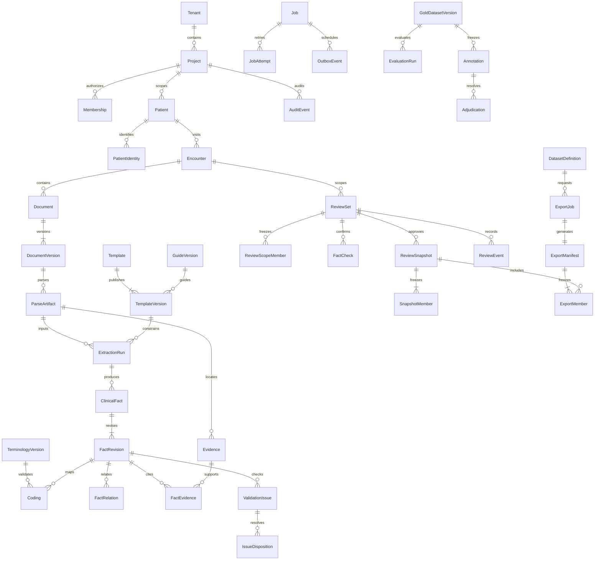

# S0 数据与审核基线

版本 1.0.0，2026-09-16。以下总表描述 S1–S4 目标模型。S0 的四张范围基础表及 S1 的身份、文书、任务、解析与审计迁移已实现；S2–S4 实体仍待开发，实际迁移见文末 S1 记录。

## 数据归属

所有业务表携带 `tenant_id, project_id, id`，被引用表提供复合唯一键；复合外键必须同时引用作用域与 ID。PatientIdentity 的可信键 `(tenant_id, project_id, source_system, source_id)` 唯一，身份映射单独授权；名称不是关联键。Encounter 的患者引用也受复合外键约束。

初始迁移已验证同项目关联、跨项目外键拒绝，以及基础表 RLS。PostgreSQL 的 `app.tenant_id`／`app.project_id` 用事务局部 `set_config(..., true)` 设置；无上下文默认不可见，事务结束不能遗留上下文。S1 根据验证过的 OIDC 成员关系赋值，任何客户端 header 或请求体不能直接设置。迁移角色与 API／Worker 角色分开，后两者禁止 superuser/BYPASSRLS。当前 Compose 的管理员仅供本地迁移和测试，不得配置为生产应用账号。

## 审核范围及不可变版本

ReviewSet 为同次 Encounter 的显式集合，不能按患者所有文书隐式扩展。ReviewScopeMember 固定 DocumentVersion + ExtractionRun + FactRevision 清单。集合、事实、文书独立版本；逐项确认绑定修订 UUID，最终声明独立。

最终审核事务锁定 ReviewSet，比较 expected_scope_revision，重新读取全部成员、有效运行、逐项确认和阻断项，写不可变 ReviewSnapshot/SnapshotMember 与事件。任何版本不符返回 409。必须全部处置阻断项、全部复核、明确声明，缺一不可。

人工更正追加 FactRevision；事实、证据、编码、关联、范围、新文书、有效运行发生改变时，同一事务增加 scope_revision 并失效当前审核。历史快照、模型原始输出均不改写。ExportManifest 在创建时冻结快照或显式草稿修订，下载再次校验当前能力与有效期。

## 事实、证据与时间

`normalized=null` 必须且只能伴随 missing_reason：missing / not_mentioned / explicitly_unknown / not_applicable / unreadable。否定是 assertion=negated，与缺失独立；剂量不详不得补常用剂量。十进制、金额用字符串传输、数据库 NUMERIC 存储，保留原始值、单位、比较符。

所有有效事实至少一处证据；Evidence 包含文书版本、解析版本、text_version、1 起始页码、quote、code point 半开 span、多 bbox 与 block_id。bbox 采用归一化页面左上原点，ParseArtifact 保存页尺寸、旋转和转换矩阵。文本规范化只在解析阶段完成并记录映射，前端不得重新规范化。缺失类事实必须有依据，如“剂量不详”或明确的原文区域；纯猜测不生成事实。

同一药物与其剂量、频率用稳定 entity_group_id 关联；检验值、单位、标本、方法同样按组保存，不能依赖数组索引。原始相对时间保留 precision=relative；文书时间与事件时间分开，不把“5年”自动变为起病日期。

两类模板：`packages/contracts/json-schema/`；Pydantic 是唯一生成源。JSON Schema 校验字段结构，Pydantic 还执行跨字段空值、数值与坐标约束；服务层后续校验数据库归属和审核事务。

## 迁移路线

| 阶段 | 迁移内容 | 必须验证 |
| --- | --- | --- |
| S0 / 0001_scope | 租户、项目、患者、就诊；复合键与基础 RLS | upgrade、元数据差异检查、downgrade/upgrade、隔离及连接复用 |
| S1 | OIDC 用户映射、Membership、PatientIdentity、文件版本、任务、Outbox、Audit | 可信来源唯一；文件哈希按项目去重；租约/幂等唯一；无跨范围引用 |
| S2 | 模板/指南版本、解析、抽取、事实修订、证据、关系、词库及问题 | 不可变触发器／应用权限；指定词库版本外键；证据版本与坐标 |
| S3 | 审核范围、逐项确认、快照、导出清单及用途 | 并发条件更新；不可变快照；默认审核导出 |
| S4 | 标注、裁决、冻结金标准、评测 | 患者分组隔离、冻结内容 hash、二审来源 |

先扩展兼容列／表，回填、验证，再移除旧结构；线上不直接 downgrade 有临床数据的迁移。初始迁移不能依赖运行时模型 `create_all`，已固定列定义以保持历史可重放。

## S1 实际迁移（2026-09-17）

`0002_documents` 新增 users、memberships、patient_identities、encounter_details、documents、document_versions、jobs、job_attempts、parse_artifacts、outbox_events、idempotency_keys、audit_events；`0003_association` 强制文书关联的就诊属于同一患者。S1 表、查询索引与元数据已通过 Alembic drift check。版本/解析/审计既受数据库写权限限制，也有拒绝 UPDATE/DELETE 的触发器。原件 SHA-256 唯一范围为 tenant+project；幂等键唯一范围为 tenant+project+actor+operation+key。

身份映射只允许当前已校验 issuer/subject；成员只允许当前已校验 user_id。项目数据只允许当前事务 tenant/project；两类应用角色均非超级用户且不得 BYPASSRLS。Outbox 为无临床内容的路由元数据，API 只写、投递器读写。更多运行约束和持久化对象前缀见 [S1 运行手册](../operations/s1.md)。S2–S4 的事实、审核快照和导出模型仍未迁移。
